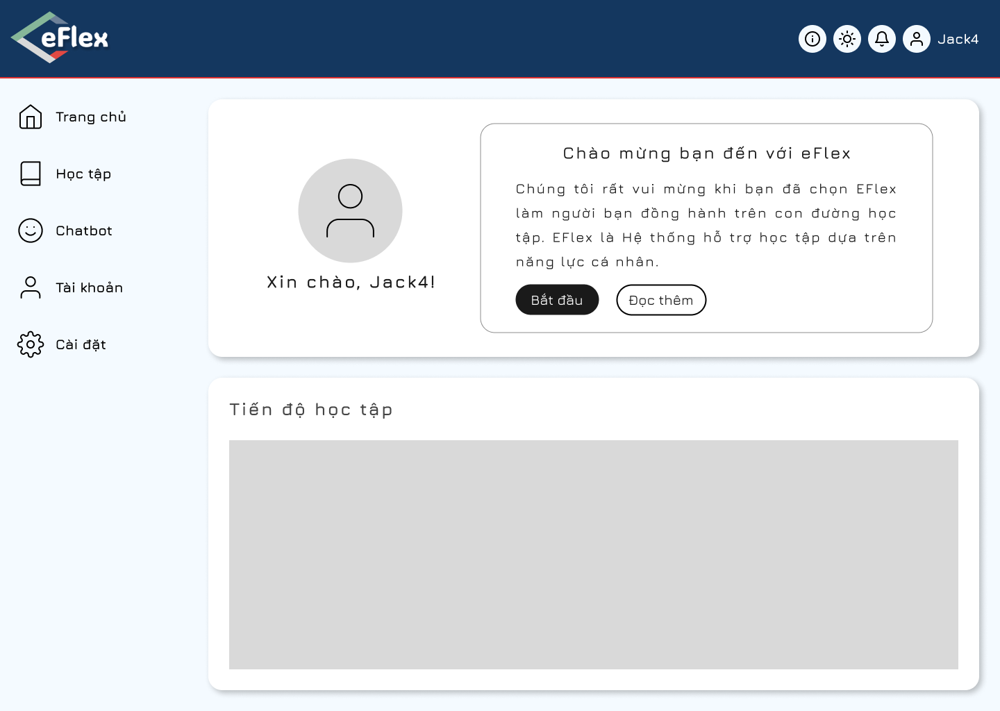

# eFlex - Hệ thống hỗ trợ học tập dựa trên năng lực cá nhân

eFlex là một ứng dụng web tiên tiến hỗ trợ quá trình học tập cá nhân hóa, được thiết kế nhằm đáp ứng nhu cầu học tập đa dạng của từng cá nhân. Với eFlex, người dùng có thể tiếp cận các tài nguyên học tập phù hợp với năng lực, theo dõi tiến độ, và cải thiện hiệu quả học tập của mình.

##  Tính năng chính:
- **Hệ thống cá nhân hóa học tập:** Cung cấp lộ trình học tập dựa trên năng lực và nhu cầu của người học.
- **Theo dõi tiến độ:** Báo cáo chi tiết và trực quan hóa quá trình học tập.
- **Gợi ý tài liệu học tập:** Đề xuất tài liệu phù hợp nhất với mục tiêu học tập của bạn.
- **Tích hợp Gemini API:** Chatbot hỗ trợ học tập thông minh, tăng cường tính tương tác và tự động hóa.

##  Giao diện

##  Cách sử dụng:
1. Clone dự án: `git clone https://github.com/`
2. Cài đặt phụ thuộc: `-`
3. Chạy ứng dụng: `-`
4. Truy cập ứng dụng tại `-`

## API 
### USER

### AUTH

### TEST EXERCISER AND EXERCISE

### CATEGORY, FILE UPLOAD AND HISTORY LEARN

### SECTION, PROGRESS SECTION AND LESSON

### COURSE, CHATBOT

##  Đóng góp
Rất mong nhận được sự đóng góp từ cộng đồng! Hãy mở Pull Request hoặc liên hệ qua email: nguyentoanthang190404@gmail.com.

---

Chúng tôi hy vọng eFlex sẽ trở thành một công cụ hữu ích, mang lại trải nghiệm học tập hiệu quả và thú vị cho bạn!
